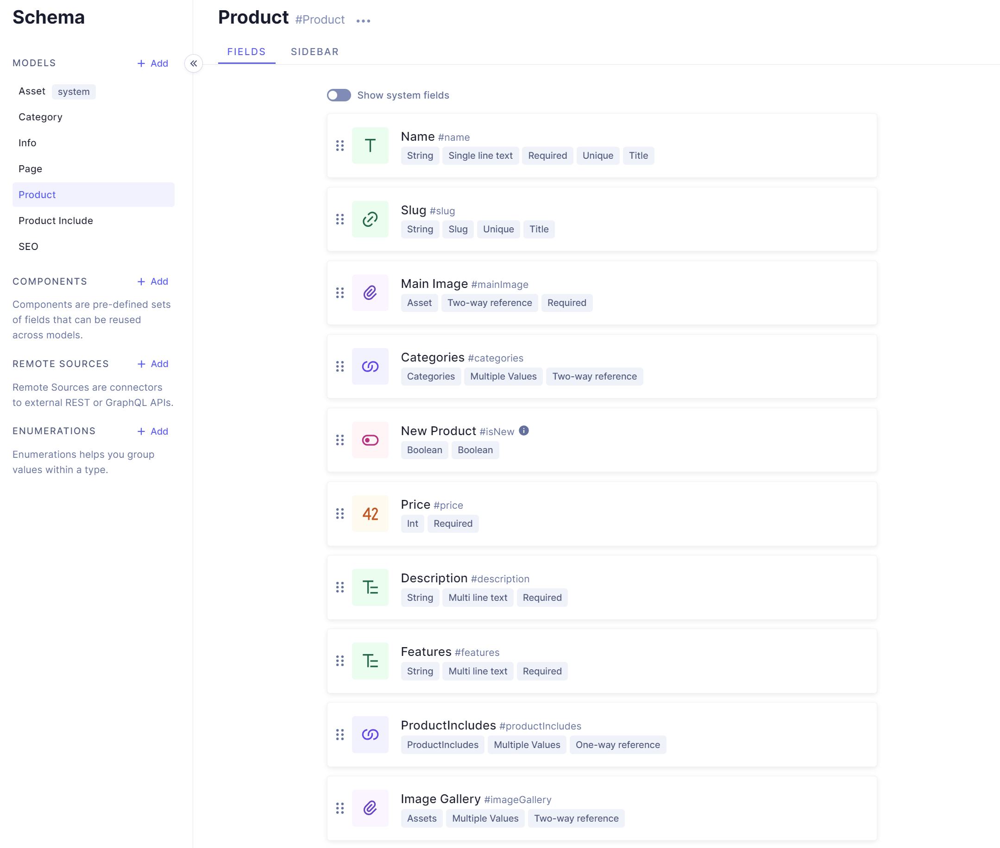

# Frontend Mentor - Audiophile e-commerce website solution

This is a solution to the [Audiophile e-commerce website challenge on Frontend Mentor](https://www.frontendmentor.io/challenges/audiophile-ecommerce-website-C8cuSd_wx). Frontend Mentor challenges help you improve your coding skills by building realistic projects.

## Table of contents

- [Overview](#overview)
  - [The challenge](#the-challenge)
  - [Screenshots](#screenshot)
  - [Links](#links)
- [My process](#my-process)
  - [Built with](#built-with)
- [Author](#author)

## Overview

### The challenge

Users should be able to:

- View the optimal layout for the app depending on their device's screen size
- See hover states for all interactive elements on the page
- Add/Remove products from the cart
- Edit product quantities in the cart
- Fill in all fields in the checkout
- Receive form validations if fields are missed or incorrect during checkout
- See correct checkout totals depending on the products in the cart
  - Shipping always adds $50 to the order
  - VAT is calculated as 20% of the product total, excluding shipping
- See an order confirmation modal after checking out with an order summary
- **Bonus**: Keep track of what's in the cart, even after refreshing the browser (`localStorage` could be used for this if you're not building out a full-stack app)

### Screenshots

### Links

- Solution URL: [Solution](https://www.frontendmentor.io/solutions/ecommerce-site-built-with-nextjs-graphcms-graphql-formik-51h2UUo4Bq)
- Live Site URL: [https://audiophile-next.vercel.app/](https://audiophile-next.vercel.app/)

## My process

### Built with

- Semantic HTML5 markup
- CSS custom properties
- Flexbox
- CSS Grid
- Mobile-first workflow
- [React](https://reactjs.org/) - JS library
- [Next.js](https://nextjs.org/) - React framework
- [Formik](https://formik.org/) - Open Source form library for React
- [Hygraph](https://hygraph.com/) - Content Management System
- [GraphQL](https://graphql.org/) - Query language
- [React-toastify](https://github.com/fkhadra/react-toastify/) - React-Toastify allows you to add notifications to your app with ease.
- [Husky](https://typicode.github.io/husky/#/) - Git pre-commit hooks

## Author

- Website - [Sheri Richardson](https://sheri.dev)
- Frontend Mentor - [@shericodes](https://www.frontendmentor.io/profile/shericodes)
- Twitter - [@shericodes](https://www.twitter.com/shericodes)
